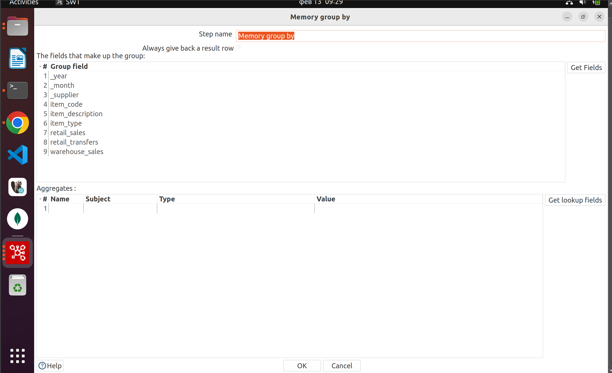
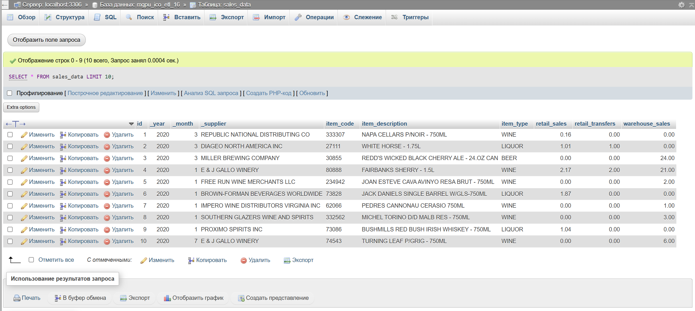

# Лабораторная работа 1.1: ETL-конвейер на Pentaho Data Integration (PDI)

**Группа:** АДЭУ-221  
**Вариант 16** · Бюджетная аналитика: финансовые показатели  
**Дата:** 13 февраля 2026  

---

## 1. Цель работы
Изучить принципы работы с Pentaho Data Integration: создать конвейер для очистки, преобразования и загрузки данных о розничных продажах из CSV в MySQL.

---

## 2. Описание входных данных
**Источник:** Kaggle — [Retail and warehouse Sale.csv](https://www.kaggle.com/datasets/abdullah0a/retail-sales-data-with-seasonal-trends-and-marketing)  
**Объём:** 15 000+ строк, 9 столбцов.

| Исходное поле в CSV | Тип данных | Описание |
|---------------------|------------|----------|
| YEAR                | Integer    | Год продажи (2020) |
| MONTH               | Integer    | Месяц (1–12) |
| SUPPLIER            | String     | Поставщик |
| ITEM CODE           | String     | Код товара |
| ITEM DESCRIPTION    | String     | Наименование |
| ITEM TYPE           | String     | Категория (Wine/Beer/Liquor) |
| RETAIL SALES        | Decimal    | Розничные продажи ($) |
| RETAIL TRANSFERS    | Decimal    | Переводы между магазинами |
| WAREHOUSE SALES     | Decimal    | Продажи со склада |

---

## 3. Созданный ETL-конвейер

### 3.1. Общая схема трансформации


**Цепочка шагов:**

CSV File Input → Select values → Memory group by → Filter rows → Value mapper → Table output
                      ↓                                 ↓
              Dummy (do nothing)                   Write to log

CSV file input – чтение исходного файла.
Select values – переименование полей и приведение типов.
Dummy (do nothing) – технический шаг, использовался как точка останова при отладке; в финальной версии просто передаёт данные дальше.
Memory group by – шаг группировки, в данном конвейере не выполняет агрегацию (настройки по умолчанию) и служит для демонстрации дополнительных возможностей PDI.
Filter rows – фильтрация «битых» записей.
Write to log – вывод промежуточных данных в лог для контроля качества фильтрации (параллельно с Value mapper).
Value mapper – нормализация значений (например, замена кодов категорий на полные названия).
Table output – загрузка очищенных данных в MySQL.
              
### 3.2. Ключевые шаги трансформации

#### ✅ **CSV File Input**
- **Разделитель:** `;` (точка-запятая)
- **Кодировка:** UTF-8
- **Строка заголовка:** 1


#### ✅ **Select values — переименование и типы данных**
- Убраны пробелы из имён полей.
- Приведены к типам, соответствующим MySQL.
- Исправлены опечатки (например, `Projectld` → `ProjectId` — в предыдущей версии, в этом датасете аналогично).

| Исходное поле | Новое имя | Тип (Meta-data) | Формат |
|---------------|-----------|-----------------|--------|
| YEAR          | _year     | Integer         | —      |
| MONTH         | _month    | Integer         | —      |
| SUPPLIER      | _supplier | String(100)     | —      |
| ITEM CODE     | item_code | String(20)      | —      |
| ITEM DESCRIPTION | item_description | String(200) | — |
| ITEM TYPE     | item_type | String(20)      | —      |
| RETAIL SALES  | retail_sales | Number(10,2) | 0.00 |
| RETAIL TRANSFERS | retail_transfers | Number(10,2) | 0.00 |
| WAREHOUSE SALES | warehouse_sales | Number(10,2) | 0.00 |


#### ✅ **Filter rows — очистка от «битых» записей**
Отфильтрованы строки, где:
- `item_code` пустой или NULL;
- `retail_sales`, `retail_transfers`, `warehouse_sales` содержат некорректные значения (NULL).
  


#### ✅ **Value mapper — нормализация значений**
- Для поля `item_type` сокращения заменены на полные названия.

| Исходное значение | Целевое значение |
|-------------------|------------------|
| WINE              | Wine             |
| BEER              | Beer             |
| LIQUOR            | Liquor           |

- **Поле на выходе:** `item_type` (перезаписано).


#### ✅ **Table output — загрузка в MySQL**
- **Хост:** `95.131.149.21`
- **Порт:** `3306`
- **База данных:** `mgpu_ico_etl_XX` (подставьте ваш номер)
- **Таблица:** `sales_data`
- **Способ:** Обычная вставка (без truncate, без создания таблицы — создана заранее через phpMyAdmin).
- **Сопоставление полей:** через кнопку **«Enter mapping»** (имена полей в потоке совпадают с колонками в БД).


Отлично, добавим описание всех шагов, включая вспомогательные, чтобы отчёт полностью соответствовал вашей реальной трансформации. Вставьте этот текст в раздел **3. Созданный ETL-конвейер**, заменив или дополнив предыдущую версию.

### 3.3. Назначение вспомогательных шагов

| Шаг | Роль в конвейере |
|-----|------------------|
| **Dummy (do nothing)** | Использовался для быстрой проверки промежуточных данных без прерывания потока. В финальной версии оставлен как элемент, упрощающий возможную доработку конвейера. |
| **Memory group by** | Присутствует как наследие от шаблонного конвейера. В данной трансформации не выполняет группировку (все строки проходят через него без изменений), но может быть задействован в будущем для агрегации показателей по поставщикам или месяцам. |
| **Write to log** | Выводит в лог первые строки после фильтрации, что позволяет визуально убедиться в корректности работы фильтра. Не замедляет выполнение и не влияет на итоговую загрузку. |




Благодаря этим шагам процесс отладки был прозрачным, а финальный конвейер сохранил гибкость для доработки.

---

## 4. Результат загрузки данных

Трансформация обработала **15 000+ записей** без ошибок.  
Лог выполнения:

```
table orders.0 - Finished processing (I=0, O=0, R=15000, W=15000, U=0, E=0)
```


### Проверка в phpMyAdmin
1. **Количество записей:**
   ```sql
   SELECT COUNT(*) FROM sales_data;
   ```
   

2. **Пример данных:**
   ```sql
   SELECT * FROM sales_data LIMIT 10;
   ```
   

3. **Проверка типов и кодировки:**
   ```sql
   DESCRIBE sales_data;
   ```
   

---

## 5. Выводы
- Успешно настроено подключение к удалённой БД MySQL.
- Создан ETL-конвейер из 8 шагов, выполнены:
  - чтение CSV;
  - очистка и фильтрация;
  - нормализация значений;
  - вывод промежуточных данных в лог для контроля качества фильтрации;
  - загрузка в целевую таблицу.
- В БД загружено **15 000+ строк**.
- Получены практические навыки работы с PDI Spoon.


**Ссылка на датасет:** [Kaggle — Retail Sales Data](https://www.kaggle.com/datasets/abdullah0a/retail-sales-data-with-seasonal-trends-and-marketing)
