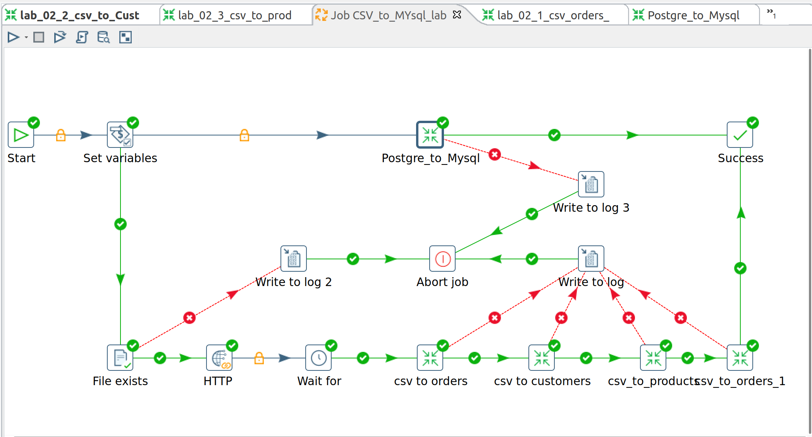
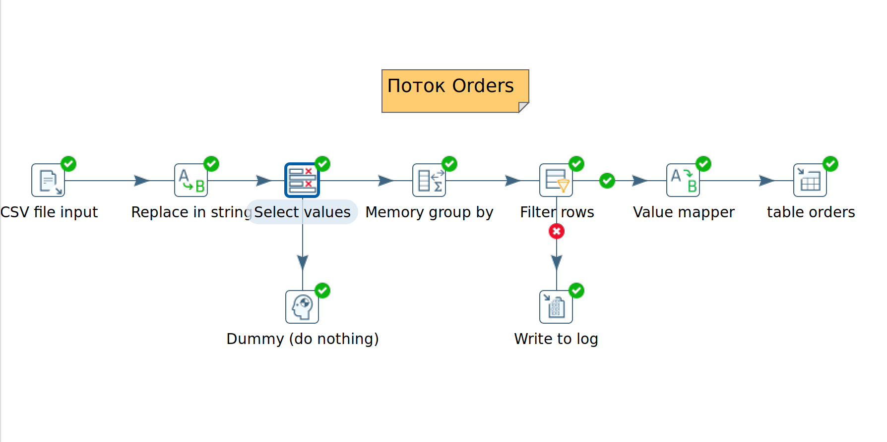
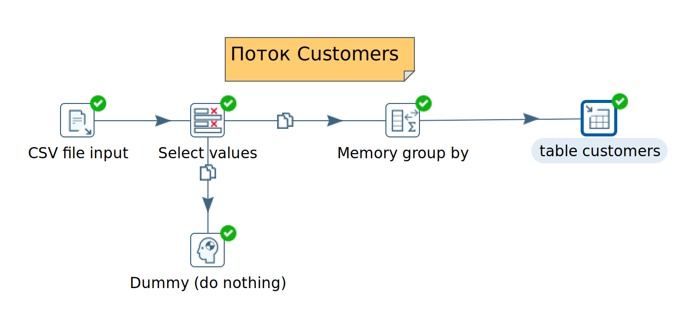
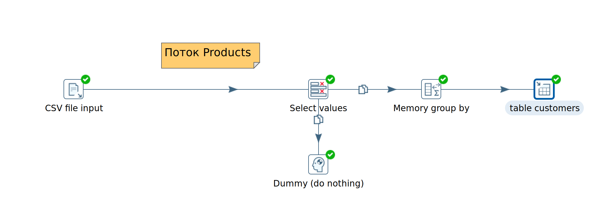
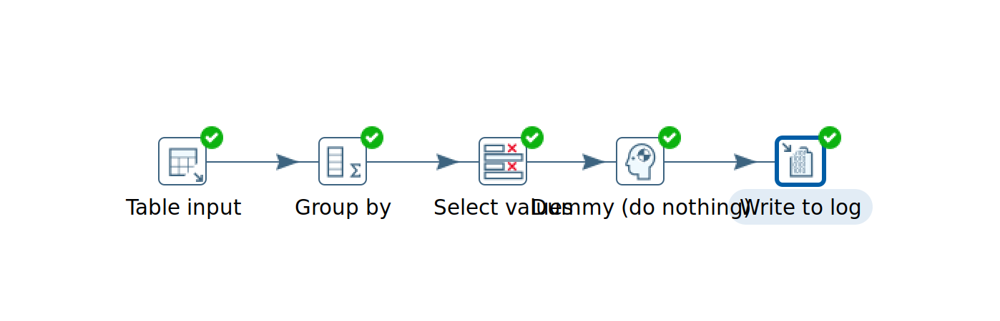

# Лабораторная работа: ETL-процесс загрузки данных из CSV в MySQL

## Вариант задания
**№16**: Заказы со скидкой > 15%.  
Дополнительные задания:
- Анализ категорий товаров.
- Отчёт по сегментам клиентов.

## Цель работы
Получение практических навыков создания сложного ETL-процесса, включающего динамическую загрузку файлов по HTTP, нормализацию базы данных, обработку дубликатов и настройку обработки ошибок с использованием Pentaho Data Integration (PDI).

## Используемые технологии
- Pentaho Data Integration 9.4
- MySQL (удалённый сервер)
- Исходные данные: CSV-файл с информацией о заказах


## Описание логики Job (CSV_to_MySQL.kjb)
Главный Job управляет последовательностью загрузки и анализа данных.

### Этапы Job:
1. **Set Variables** – задаётся переменная `CSV_FILE_PATH` с путём к локальному файлу.
2. **Check File Exists** – проверка наличия файла по указанному пути.
   - Если файл отсутствует, выполняется шаг **HTTP** для скачивания.
   - Если файл существует, переход к следующему шагу.
3. **HTTP (Download)** – загрузка файла из репозитория GitHub.
   - URL: `https://raw.githubusercontent.com/BosenkoTM/workshop-on-ETL/main/data_for_lessons/samplestore-general.csv`
   - Target file: `${CSV_FILE_PATH}`
4. **Wait for** – небольшая пауза для гарантии завершения загрузки.
5. Последовательный вызов трансформаций:
   - `lab_02_1_csv_orders_full.ktr` – загрузка расширенной таблицы заказов.
   - `lab_02_1_csv_orders_job.ktr` - загрузка справочника заказов.
   - `lab_02_1_csv_orders_1_job.ktr` - загрузка справочника заказов c применением фильтра `discount > 0.15`.
   - `lab_02_2_csv_ti_Customers.ktr` – загрузка справочника клиентов.
   - `lab_02_2_csv_ti_products.ktr` – загрузка справочника продуктов.
   - `category_analytics.ktr` – анализ категорий.
   - `segment_analytics.ktr` – анализ сегментов.
6. **Write to log / Abort job** – в случае ошибки процесс прерывается с записью в лог.

### Скриншоты настроек Job
#### Шаг HTTP


## Трансформация lab_02_1_csv_orders_full.ktr, lab_02_1_csv_orders_job.ktr, lab_02_1_csv_orders_1_job.ktr
Загружает все поля из CSV в таблицу `orders_full`, включая ключи для связи с клиентами и продуктами.

### Поля таблицы `orders_full`
- `row_id` (INT, PRIMARY KEY)
- `order_id` (VARCHAR)
- `order_date` (DATE)
- `ship_date` (DATE)
- `ship_mode` (VARCHAR)
- `customer_id` (VARCHAR)
- `customer_name` (VARCHAR)
- `segment` (VARCHAR)
- `country`, `city`, `state`, `postal_code`, `region`
- `product_id` (VARCHAR)
- `category`, `sub_category`, `product_name`
- `sales` (DECIMAL)
- `quantity` (INT)
- `discount` (DECIMAL)
- `profit` (DECIMAL)
- `returned` (TINYINT)
- `person` (VARCHAR)

### Поля таблицы `orders` и `orders_1`
- `row_id` (INT, PRIMARY KEY)
- `order_date` (DATE)
- `ship_date` (DATE)
- `ship_mode` (VARCHAR)
- `sales` (DECIMAL)
- `quantity` (INT)
- `discount` (DECIMAL)
- `profit` (DECIMAL)
- `returned` (TINYINT)

### Последовательность шагов
1. **CSV File Input** – чтение данных, все поля как строки.
2. **Replace in string** – замена запятой на точку в полях `sales`, `profit` (из-за десятичного разделителя в исходных данных).
3. **Select values (первый)** – преобразование типов на вкладке Meta-data:
   - `row_id` → Integer
   - `order_date`, `ship_date` → Date (формат `yyyy-MM-dd`)
   - числовые поля → Number
   - строковые → String
4. **Memory Group By** – дедупликация по `row_id`. Группировка по `row_id`, для остальных полей агрегация **First**.
5. **Value Mapper** – преобразование `returned`: `Yes` → `1`, иначе `0`.
6. **Table Output** – запись в таблицу MySQL.
 

## Трансформация lab_02_2_csv_ti_Customers.ktr
Загружает уникальных клиентов в таблицу `customers`. Используется аналогичная схема:
- CSV Input → Select values (выбор полей клиента) → Memory Group By по `customer_id` → Table Output.
 

## Трансформация lab_02_2_csv_ti_products.ktr
Загружает уникальные продукты в таблицу `products` с группировкой по `product_id`.
 

## Аналитические трансформации

### category_analytics.ktr
Агрегация данных по категориям товаров.

**Шаги:**
- **Table Input**: SQL-запрос к `orders_full`:
  ```sql
  SELECT category, order_id, quantity, sales, profit
  FROM orders_full
  ```
- **Group By** – группировка по `category`:
  - `number_of_orders` = COUNT(DISTINCT order_id) → **Number of Distinct Values (N)**
  - `total_quantity` = SUM(quantity) → **Sum**
  - `total_sales` = SUM(sales) → **Sum**
  - `avg_sales_per_order` = AVG(sales) → **Average (Mean)**
  - `total_profit` = SUM(profit) → **Sum**
  - `avg_profit` = AVG(profit) → **Average (Mean)**
- **Text file output** – сохранение результата в CSV-файл (`category_analysis.csv`).
- (Опционально) **Write to log** для вывода в лог.
  

### segment_analytics.ktr
Аналогичная трансформация, но группировка по полю `segment`.

**Table Input:**
```sql
SELECT segment, order_id, quantity, sales, profit
FROM orders_full
```
**Group By** по `segment` с теми же агрегатами. Результат сохраняется в `segment_analysis.csv`.
  


## Проверка данных в БД
Выполнены следующие SQL-запросы для контроля загрузки:

### Количество записей в таблицах
```sql
SELECT COUNT(*) AS orders_count FROM orders_full;
SELECT COUNT(*) AS customers_count FROM customers;
SELECT COUNT(*) AS products_count FROM products;
```
| orders_count | customers_count | products_count |
|--------------|-----------------|----------------|
| 4997         | 4910            | 5371           |

### Примеры данных из таблиц
**orders_full** (первые 5 строк):
```sql
SELECT row_id, order_id, order_date, customer_id, product_id, sales, profit
FROM orders_full
LIMIT 5;
```
| row_id | order_id        | order_date | customer_id | product_id         | sales   | profit  |
|--------|-----------------|------------|-------------|--------------------|---------|---------|
| 2      | CA-2018-152156  | 2018-11-08 | CG-12520    | FUR-CH-10000454    | 731.94  | 219.58  |
| 5      | US-2017-108966  | 2017-10-11 | SO-20335    | OFF-ST-10000760    | 22.37   | 2.52    |
| 7      | CA-2016-115812  | 2016-06-09 | BH-11710    | OFF-AR-10002833    | 7.28    | 1.97    |
| 9      | CA-2016-115812  | 2016-06-09 | BH-11710    | OFF-BI-10003910    | 18.50   | 5.78    |
| 11     | CA-2016-115812  | 2016-06-09 | BH-11710    | FUR-TA-10001539    | 1706.18 | 85.31   |

**customers** (первые 5):
```sql
SELECT customer_id, customer_name, segment, city, state
FROM customers
LIMIT 5;
```
| customer_id | customer_name      | segment   | city              | state      |
|-------------|--------------------|-----------|-------------------|------------|
| CC-12670    | Craig Carreira     | Consumer  | Chicago           | Illinois   |
| SO-20335    | Sean O'Donnell     | Consumer  | Fort Lauderdale   | Florida    |
| BS-11590    | Brendan Sweed      | Corporate | Columbus          | Indiana    |
| RF-19840    | Roy Franz�sisch    | Consumer  | Chesapeake        | Virginia   |
| DR-12880    | Dan Reichenbach    | Corporate | Inglewood         | California |

**products** (первые 5):
```sql
SELECT product_id, category, sub_category, product_name
FROM products
LIMIT 5;
```
| product_id       | category        | sub_category | product_name                                                              |
|------------------|-----------------|--------------|---------------------------------------------------------------------------|
| OFF-AP-10002578  | Office Supplies | Appliances   | Fellowes Premier Superior Surge Suppressor, 10-Out...                     |
| OFF-PA-10000575  | Office Supplies | Paper        | Wirebound Message Books, Four 2 3/4 x 5 White Form...                     |
| TEC-MA-10002790  | Technology      | Machines     | NeatDesk Desktop Scanner & Digital Filing System                          |
| OFF-AR-10000255  | Office Supplies | Art          | Newell 328                                                                |
| TEC-PH-10001061  | Technology      | Phones       | Apple iPhone 5C                                                           |

### Результаты аналитических запросов
**Анализ категорий**:
```sql
SELECT 
    category,
    COUNT(DISTINCT order_id) AS number_of_orders,
    SUM(quantity) AS total_quantity,
    SUM(sales) AS total_sales,
    AVG(sales) AS avg_sales_per_order,
    SUM(profit) AS total_profit,
    AVG(profit) AS avg_profit
FROM orders_full
GROUP BY category
ORDER BY total_sales DESC;
```
| category        | number_of_orders | total_quantity | total_sales | avg_sales_per_order | total_profit | avg_profit |
|-----------------|------------------|----------------|-------------|---------------------|--------------|------------|
| Technology      | 846              | 3380           | 438032.44   | 491.618900          | 92236.69     | 103.520415 |
| Office Supplies | 2482             | 11474          | 386590.83   | 127.756388          | 68595.38     | 22.668665  |
| Furniture       | 1008             | 4122           | 363713.06   | 336.771352          | 7588.86      | 7.026722   |

**Отчёт по сегментам**:
```sql
SELECT 
    segment,
    COUNT(DISTINCT order_id) AS number_of_orders,
    SUM(quantity) AS total_quantity,
    SUM(sales) AS total_sales,
    AVG(sales) AS avg_sales_per_order,
    SUM(profit) AS total_profit,
    AVG(profit) AS avg_profit
FROM orders_full
GROUP BY segment
ORDER BY total_sales DESC;
```
*Пример вывода:*
| segment     | number_of_orders | total_quantity | total_sales | avg_sales_per_order | total_profit | avg_profit |
|-------------|------------------|----------------|-------------|---------------------|--------------|------------|
| Consumer    | 1921             | 9793           | 604778.75   | 233.145239          | 82277.68     | 31.718458  |
| Corporate   | 1135             | 5830           | 358966.66   | 237.254898          | 51110.30     | 33.780767  |
| Home Office | 656              | 3353           | 224590.92   | 252.349348          | 35032.95     | 36.362865  |

## Выводы
В ходе лабораторной работы был создан ETL-процесс, автоматизирующий загрузку данных из CSV-файла в MySQL. Реализованы:
- динамическая загрузка файла по HTTP;
- проверка наличия файла;
- дедупликация записей;
- обработка ошибок (некорректные даты, значения);
- нормализация данных (выделение клиентов и продуктов в отдельные таблицы);
- аналитические отчёты по категориям и сегментам.

Все трансформации и job работают стабильно, данные загружены корректно, что подтверждается контрольными SQL-запросами и полученными аналитическими результатами.

## Файлы
- [Job](lab_2/Job CSV_to_MYsql_lab2.kjb)
- [Трансформация загрузки orders_full](transformations/lab_02_1_csv_orders_full.ktr)
- [Трансформация загрузки orders](transformations/lab_02_1_csv_orders_job.ktr)
- [Трансформация загрузки orders_1](transformations/lab_02_1_csv_orders_1_job.ktr)
- [Трансформация загрузки customers](transformations/lab_02_2_csv_ti_Customers.ktr)
- [Трансформация загрузки products](transformations/lab_02_2_csv_ti_products.ktr)
- [Трансформация анализа категорий](transformations/category_analytics.ktr)
- [Трансформация анализа сегментов](transformations/segment_analytics.ktr)
