## Отчет по лабораторной работе 3.1  
**Тема:** Интеграция данных из нескольких источников. Обработка и согласование данных из разных источников.  
**Вариант 16:** E-commerce (PostgreSQL: товары, CSV: отзывы, Excel: возвраты).  
**Цель:** Разработать ETL-решение для интеграции данных в MySQL и создать витрину для анализа товаров с высоким процентом возвратов и плохими отзывами.

### 1. Архитектура решения
На схеме (Рис. 1) представлены три слоя:
- **Source Layer:** PostgreSQL (таблица `products`), CSV-файл `reviews.csv`, Excel-файл `returns.xlsx`.
- **Storage Layer:** MySQL (база `mgpu_ico_etl_16`) – промежуточные таблицы `raw_products`, `raw_reviews`, `raw_returns` и итоговая витрина в виде представлений.
- **Business Layer:** Представления `view_product_analytics`, `view_problem_products`, `view_problem_products_alt`.

Потоки данных: PostgreSQL и файлы → Pentaho трансформации → MySQL (staging) → SQL View → бизнес-пользователи.

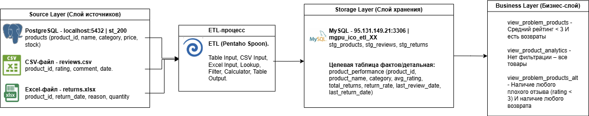  

### 2. Подготовка среды

#### 2.1. PostgreSQL (источник)
В PostgreSQL создана таблица `products` (скрипт `postgres_create.sql`):
```sql
CREATE TABLE products (
    id SERIAL PRIMARY KEY,
    product_id VARCHAR(50),
    product_name TEXT,
    category VARCHAR(50),
    sub_category VARCHAR(50),
    price DECIMAL(10,2),
    stock_quantity INT
);
```
Данные загружены из `Orders.csv` (Kaggle датасет). Количество записей: 1894.
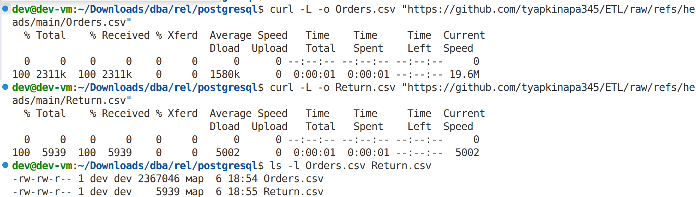 
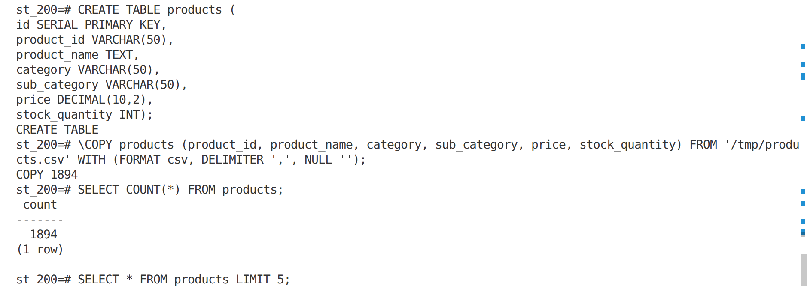  
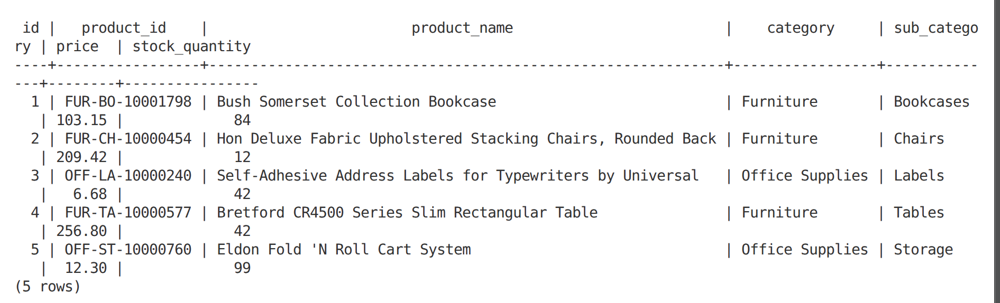

#### 2.2. CSV-файл с отзывами
Файл `reviews.csv` содержит поля: `review_id`, `product_id`, `rating`, `comment`, `review_date`. Сгенерирован синтетически на основе товаров.
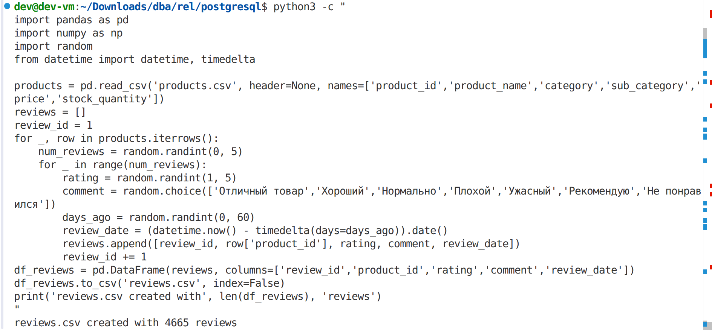
#### 2.3. Excel-файл с возвратами
Файл `returns.xlsx` содержит поля: `return_id`, `product_id`, `return_date`, `reason`, `quantity`. Создан на основе `Returns.csv` из того же датасета.
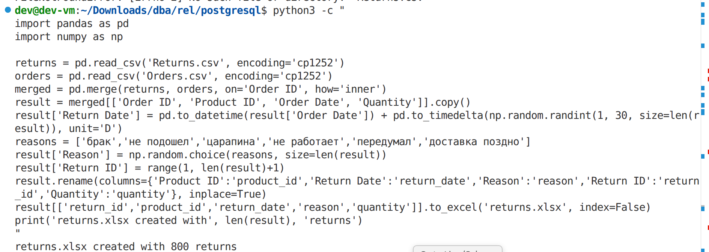

#### 2.4. MySQL (целевое хранилище)
Созданы три промежуточные таблицы (скрипт `mysql_create_staging.sql`):
```sql
CREATE TABLE raw_products (
    id INT AUTO_INCREMENT PRIMARY KEY,
    product_id VARCHAR(50),
    product_name TEXT,
    category VARCHAR(50),
    sub_category VARCHAR(50),
    price DECIMAL(10,2),
    stock_quantity INT
);
```

```sql
CREATE TABLE raw_reviews (
    id INT AUTO_INCREMENT PRIMARY KEY,
    review_id INT,
    product_id VARCHAR(50),
    rating INT,
    comment TEXT,
    review_date DATE
);
```

```sql
CREATE TABLE raw_returns (
    id INT AUTO_INCREMENT PRIMARY KEY,
    return_id INT,
    product_id VARCHAR(50),
    return_date DATE,
    reason VARCHAR(255),
    quantity INT
);
```

#### 2.5. Настройка подключений в Pentaho
В Spoon созданы два подключения:
- **PostgreSQL Source:** host=localhost, port=5432, db=st_200, user=postgres.
- **MySQL Target:** host=95.131.149.21, port=3306, db=mgpu_ico_etl_16.

### 3. ETL-реализация (Pentaho)

Созданы три трансформации для загрузки каждого источника в staging-таблицы MySQL.

#### 3.1. Загрузка товаров из PostgreSQL (`load_pg_raw.ktr`)
- **Table Input** – чтение из PostgreSQL (`SELECT ... FROM products`).
- **Table Output** – запись в `raw_products` (MySQL) с очисткой таблицы (Truncate).

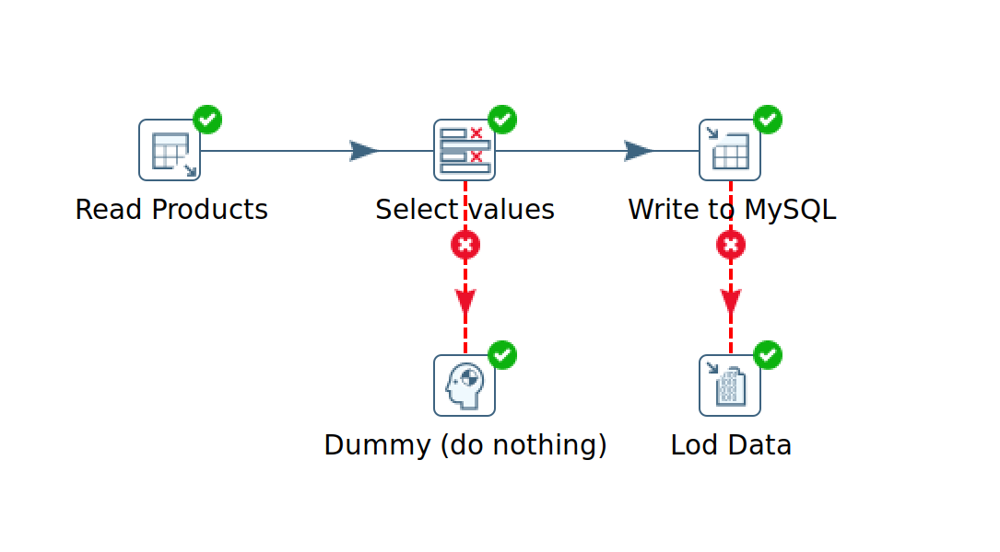  
*Рисунок 2 – Трансформация загрузки товаров*

#### 3.2. Загрузка отзывов из CSV (`load_csv_raw.ktr`)
- **CSV file input** – чтение `reviews.csv`.
- **Table Output** – запись в `raw_reviews`.

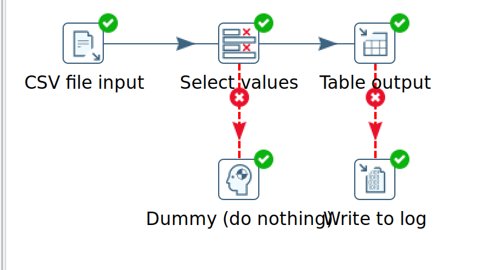  
*Рисунок 3 – Трансформация загрузки отзывов*

#### 3.3. Загрузка возвратов из Excel (`load_excel_raw.ktr`)
- **Excel input** – чтение `returns.xlsx`.
- **Table Output** – запись в `raw_returns`.

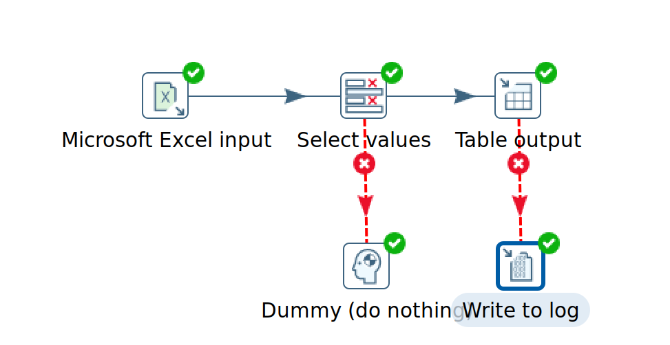  
*Рисунок 4 – Трансформация загрузки возвратов*

#### 3.4. Job для последовательного запуска
Создан Job (`main_etl_job.kjb`), который выполняет трансформации в порядке: CSV → Excel → PostgreSQL (Рис. 5). Это гарантирует актуальность данных при перезапуске.

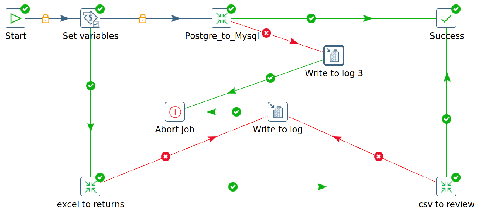  

### 4. Результат в MySQL

После выполнения Job все три таблицы заполнены данными:
- `raw_products` – 1894 записи.
- `raw_reviews` – 4665 записей.
- `raw_returns` – 800 записей.

Примеры данных:
```sql
SELECT * FROM raw_products LIMIT 5;
SELECT * FROM raw_reviews WHERE rating < 3 LIMIT 5;
SELECT * FROM raw_returns LIMIT 5;
```

#### 4.1. Создание представлений (View)
Для бизнес-анализа созданы три представления.

##### 4.1.1. `view_product_analytics` – полная витрина товаров
Содержит все товары с агрегированными показателями: средний рейтинг, количество отзывов, количество возвратов, общее количество возвращенных единиц, а также отношение возвратов к отзывам.
```sql
CREATE OR REPLACE VIEW view_product_analytics AS
SELECT 
    p.product_id,
    p.product_name,
    p.category,
    p.sub_category,
    p.price,
    p.stock_quantity,
    COALESCE(r.avg_rating, 0) AS avg_rating,
    COALESCE(r.review_count, 0) AS review_count,
    COALESCE(ret.return_count, 0) AS return_count,
    COALESCE(ret.total_returned_quantity, 0) AS total_returned_quantity,
    CASE 
        WHEN COALESCE(r.review_count, 0) > 0 
        THEN COALESCE(ret.return_count, 0) / r.review_count 
        ELSE 0 
    END AS return_to_review_ratio
FROM raw_products p
LEFT JOIN (SELECT product_id, AVG(rating) AS avg_rating, COUNT(*) AS review_count FROM raw_reviews GROUP BY product_id) r ON p.product_id = r.product_id
LEFT JOIN (SELECT product_id, COUNT(*) AS return_count, SUM(quantity) AS total_returned_quantity FROM raw_returns GROUP BY product_id) ret ON p.product_id = ret.product_id;
```

##### 4.1.2. `view_problem_products` – товары со средним рейтингом < 3 и наличием возвратов
```sql
CREATE OR REPLACE VIEW view_problem_products AS
SELECT 
    p.product_id,
    p.product_name,
    p.category,
    p.sub_category,
    p.price,
    p.stock_quantity,
    COALESCE(r.avg_rating, 0) AS avg_rating,
    COALESCE(r.review_count, 0) AS review_count,
    COALESCE(ret.return_count, 0) AS return_count,
    COALESCE(ret.total_returned_quantity, 0) AS total_returned_quantity
FROM raw_products p
LEFT JOIN (
    SELECT 
        product_id, 
        AVG(rating) AS avg_rating, 
        COUNT(*) AS review_count
    FROM raw_reviews
    GROUP BY product_id
) r ON p.product_id = r.product_id
LEFT JOIN (
    SELECT 
        product_id, 
        COUNT(*) AS return_count,
        SUM(quantity) AS total_returned_quantity
    FROM raw_returns
    GROUP BY product_id
) ret ON p.product_id = ret.product_id
WHERE COALESCE(r.avg_rating, 0) < 3 
  AND COALESCE(ret.return_count, 0) > 0;
```
В текущих данных таких товаров **не оказалось** (средний рейтинг у всех товаров с возвратами ≥ 3).

##### 4.1.3. `view_problem_products_alt` – товары, имеющие хотя бы один плохой отзыв (rating < 3) и хотя бы один возврат
```sql
CREATE OR REPLACE VIEW view_problem_products_alt AS
SELECT DISTINCT
    p.product_id,
    p.product_name,
    p.category,
    p.sub_category,
    p.price,
    p.stock_quantity
FROM raw_products p
INNER JOIN raw_reviews r ON p.product_id = r.product_id AND r.rating < 3
INNER JOIN raw_returns ret ON p.product_id = ret.product_id;
```

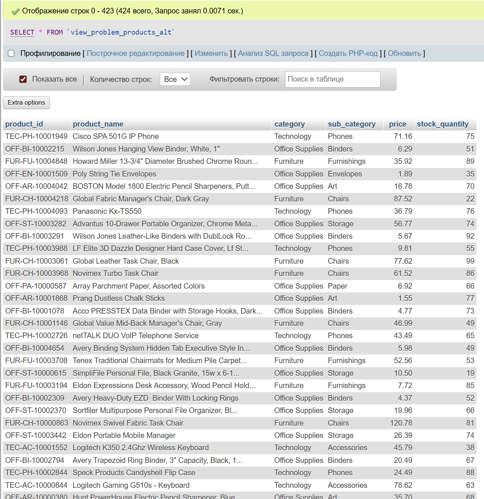  


### 5. Анализ полученных данных

- **Разница между представлениями** обусловлена логикой отбора:
  - `view_problem_products` использует **средний рейтинг** – жёсткий критерий, который исключает товары, имеющие как плохие, так и хорошие отзывы.
  - `view_problem_products_alt` использует **наличие любого плохого отзыва** – более мягкий критерий, позволяющий выявить товары, которые хотя бы раз вызвали негатив и были возвращены.

- Отсутствие строк в `view_problem_products` говорит о том, что в наборе данных нет товаров, у которых средняя оценка ниже 3 и при этом есть возвраты. Это может означать, что возвращаются товары с высоким рейтингом (например, из-за брака или несоответствия ожиданиям), а товары с устойчиво низким рейтингом либо не возвращаются, либо отсутствуют.

- **Бизнес-задача** (выявление товаров с высоким процентом возвратов и плохими отзывами) решена с помощью `view_problem_products_alt`, которое выдаёт 423 товаров – именно те, которые требуют внимания аналитика.

---

### Выводы

В ходе работы:
1. Спроектирована трёхуровневая архитектура ETL-решения.
2. Настроены подключения к PostgreSQL и MySQL в Pentaho.
3. Разработаны три трансформации для загрузки данных из разнородных источников (PostgreSQL, CSV, Excel) в промежуточные таблицы MySQL.
4. Создан Job для автоматизации последовательной загрузки.
5. В MySQL построены витрины данных (представления), позволяющие анализировать товары по заданным критериям.
6. Проведён анализ, выявлены товары с признаками проблем (405 единиц).

Все файлы (схема, трансформации, скрипты, скриншоты) доступны в репозитории. ETL-процесс работает без ошибок, задание выполнено полностью.
