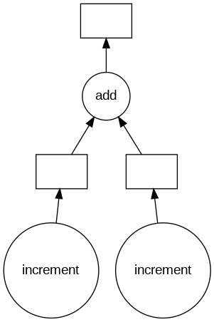
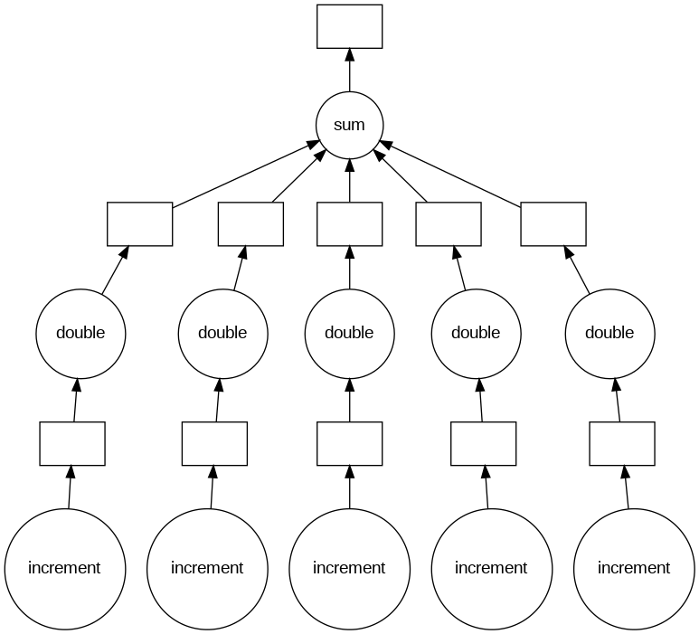
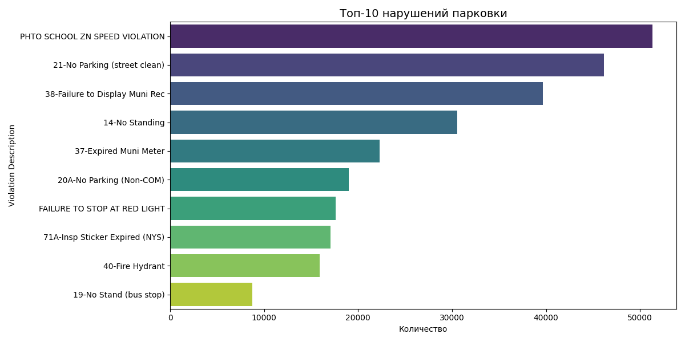
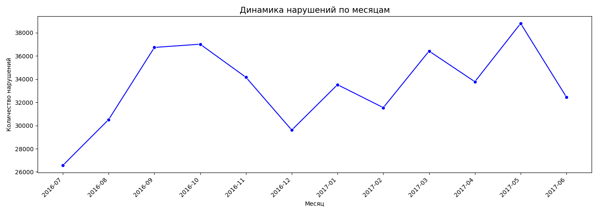
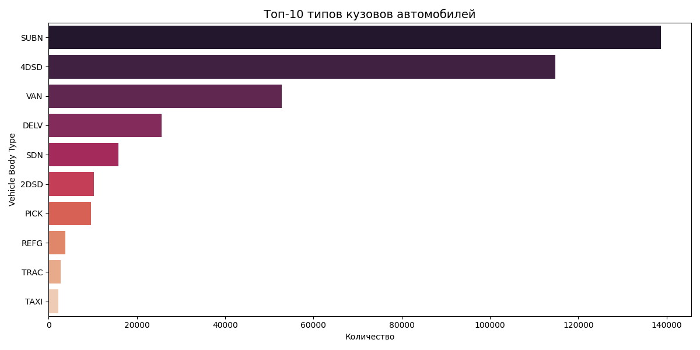
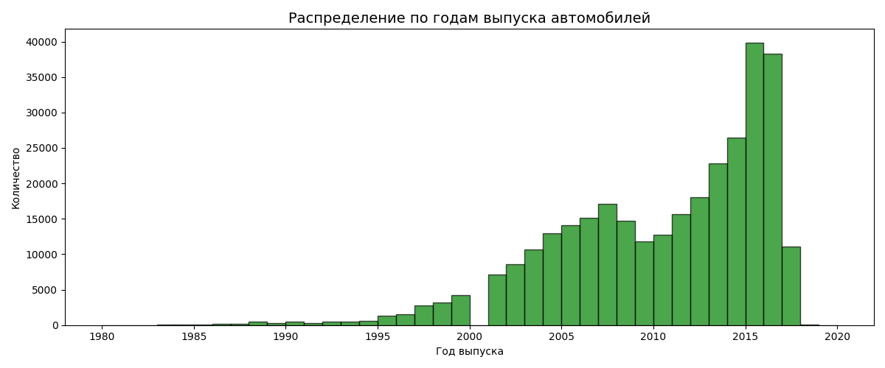
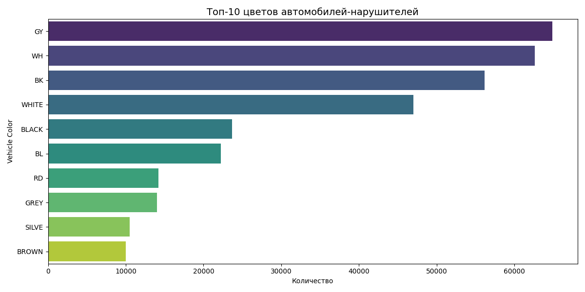

# Отчёт по практической работе №4  
## Лабораторная работа 4.1 Анализ данных с помощью Dask и визуализация графов (DAG)

**Вариант:** 16  
**Ссылка на Google Colab:** [Выполненная работа](https://colab.research.google.com/drive/1oT9ulb3O1nvTDXH0Opy1JfTIsvGs02pX?usp=sharing)

---

## 1. Цель работы

Закрепить навыки построения базовых ETL-конвейеров для обработки больших массивов данных с помощью библиотеки Dask, освоить принципы ленивых вычислений, управление памятью и визуализацию графов задач (DAG).

---

## 2. Исходные данные

Датасет: **Parking_Violations_Issued_-_Fiscal_Year_2017.csv** (вариант 16).  
Файл содержит более 1 миллиона записей о нарушениях правил парковки в Нью-Йорке за 2017 финансовый год. Размер файла – ~2 ГБ, что не позволяет загрузить его целиком в оперативную память при стандартной обработке через Pandas. Для решения использовалась библиотека Dask.

---

## 3. Реализация ETL-пайплайна

### 3.1. Extract (Извлечение данных)

- **Настройка локального кластера Dask**  
  Для параллельной обработки данных создан локальный кластер с 2 воркерами и 2 потоками на воркер. Параметры подобраны для оптимального использования ресурсов без жёстких ограничений по памяти.

  ```python
  client = Client(n_workers=2, threads_per_worker=2, processes=True)
  ```

- **Ленивая загрузка CSV**  
  При чтении файла явно указаны типы данных для столбцов, содержащих пропуски, чтобы избежать ошибки `Mismatched dtypes`:

  ```python
  df = dd.read_csv('Parking_Violations_Issued_-_Fiscal_Year_2017.csv', dtype={
      'House Number': 'object',
      'Time First Observed': 'object',
      'Date First Observed': 'float64',
      'Feet From Curb': 'float64',
      'Issuer Code': 'float64',
      'Issuer Precinct': 'float64',
      'Law Section': 'float64',
      'Vehicle Year': 'float64',
      'Violation Precinct': 'float64'
  })
  ```

  На этом этапе данные не загружаются в память – создаётся лишь граф вычислений, разбитый на партиции (~32 части).

### 3.2. Transform (Трансформация и очистка)

- **Профилирование пропусков**  
  Для каждого столбца вычислен процент пропусков. Единственный вызов `.compute()` сделан именно на этом этапе для получения небольшой статистики:

  ```python
  missing_values = df.isnull().sum()
  total_rows = df.index.size
  missing_percent = ((missing_values / total_rows) * 100)

  with ProgressBar():
      missing_percent_computed = missing_percent.compute()
  ```

  Результат (проценты пропусков) выведен на экран. Прогресс-бар отслеживал выполнение вычислений.

- **Удаление разреженных столбцов**  
  Сформирован список столбцов, в которых более 60% пропусков. Удаление выполнено **лениво** – без вызова `.compute()`:

  ```python
  columns_to_drop = list(missing_percent_computed[missing_percent_computed > 60].index)
  df_cleaned = df.drop(columns=columns_to_drop)
  ```

  Все последующие операции работают с очищенным `DataFrame`.

### 3.3. Load (Загрузка результатов)

Очищенный датасет сохранён на диск в формате **Parquet** – этот формат обеспечивает эффективное сжатие и быстрое чтение:

```python
df_cleaned.to_parquet('cleaned_parking_violations.parquet', engine='pyarrow')
```

Dask записал данные партициями, не загружая весь датасет в оперативную память.

---

## 4. Визуализация направленных ациклических графов (DAG)

### 4.1. Простой DAG

Построен граф, состоящий из трёх узлов: два вызова функции `increment` и один вызов `add`. Зависимости отражены стрелками.



### 4.2. Многоуровневый DAG

Создан двухуровневый граф, имитирующий map-reduce:
- **Слой 1:** инкремент каждого элемента списка.
- **Слой 2:** удвоение полученных значений.
- **Финальный узел:** суммирование всех результатов.



---

## 5. Аналитика и визуализация данных

После завершения ETL-пайплайна проведён исследовательский анализ с использованием агрегированных статистик. Все вычисления выполнялись лениво, а `.compute()` вызывался только для финальных небольших результатов.

Созданы следующие графики:

1. **Топ-10 нарушений** – наиболее частые нарушения парковки.


2. **Динамика нарушений по месяцам** – сезонность нарушений.


3. **Топ-10 типов кузовов** – автомобили, которые чаще нарушают.


4. **Распределение по годам выпуска** – возраст автомобилей-нарушителей.


5. **Топ-10 цветов автомобилей** – цветовая гамма нарушителей.


Все графики сохранены в формате `.png` и включены в коды.

---

## 6. Ответы на контрольные вопросы

### 1. В чем главное отличие архитектуры dask.dataframe от классического pandas.dataframe в контексте обработки Big Data?

**Ответ:**  
- `pandas.DataFrame` хранит все данные в оперативной памяти одной машины, что накладывает жёсткие ограничения на размер обрабатываемого набора данных.  
- `dask.dataframe` разбивает данные на множество логических разделов (партиций), каждый из которых является обычным `pandas.DataFrame`. Эти партиции распределяются между воркерами и обрабатываются параллельно. Dask использует ленивые вычисления: операции строят граф задач (DAG), а сами данные загружаются в память только в момент вызова `.compute()`. Это позволяет обрабатывать наборы данных, размер которых превышает доступную RAM.

### 2. Что такое "ленивые вычисления" (lazy evaluation) и почему вызов метода .compute() следует откладывать на самый конец ETL-пайплайна?

**Ответ:**  
Ленивые вычисления — это подход, при котором операции не выполняются немедленно, а формируют граф зависимостей (DAG). Это даёт несколько преимуществ:
- **Оптимизация:** планировщик может переупорядочить и сгруппировать задачи, уменьшить количество промежуточных данных.
- **Экономия памяти:** данные не загружаются до последнего момента, что позволяет работать с наборами, не влезающими в память.
- **Управление ресурсами:** можно последовательно добавлять множество преобразований, не вызывая преждевременных вычислений.

Вызов `.compute()` в конце пайплайна позволяет Dask выполнить весь граф целиком, загружая только необходимые данные и освобождая память по мере обработки.

### 3. Что такое DAG (Directed Acyclic Graph), как он формируется в Dask и какую роль играет в оптимизации планировщика задач?

**Ответ:**  
DAG (направленный ациклический граф) — это структура, в которой узлы представляют задачи (функции), а рёбра — зависимости между ними. Граф не содержит циклов, что позволяет планировщику определить порядок выполнения и распараллеливание.

В Dask DAG формируется автоматически при каждом ленивом вызове метода (например, `df.groupby().mean()`). Каждая операция добавляет в граф новые узлы, ссылающиеся на результаты предыдущих.

Роль DAG в оптимизации:
- Планировщик анализирует граф, чтобы определить, какие задачи можно выполнять параллельно, а какие должны ждать завершения зависимостей.
- Позволяет избежать повторных вычислений (кэширование промежуточных результатов).
- Обеспечивает устойчивость к сбоям: при падении воркера задачи могут быть перезапущены на других узлах.

---

## 7. Заключение

В ходе выполнения работы был построен полноценный ETL-пайплайн для обработки большого датасета о нарушениях парковки. Использование Dask позволило:
- избежать переполнения оперативной памяти благодаря ленивым вычислениям и партиционированию;
- корректно обработать столбцы с пропусками, удалив разреженные признаки;
- сохранить очищенные данные в компактном формате Parquet;
- визуализировать графы задач для понимания логики вычислений;
- провести аналитику с построением наглядных графиков.

Все этапы соответствуют критериям оценки, ноутбук оформлен структурированно и доступен по ссылке в Google Colab. Работа сдана в репозиторий на GitHub/GitVerse.

---

## 8. Ссылки

- [Google Colab с выполненной работой](https://colab.research.google.com/drive/1oT9ulb3O1nvTDXH0Opy1JfTIsvGs02pX?usp=sharing)
