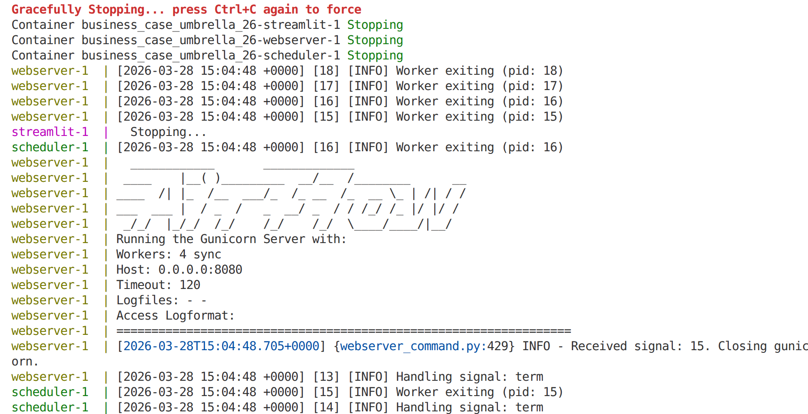
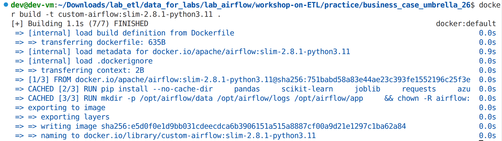
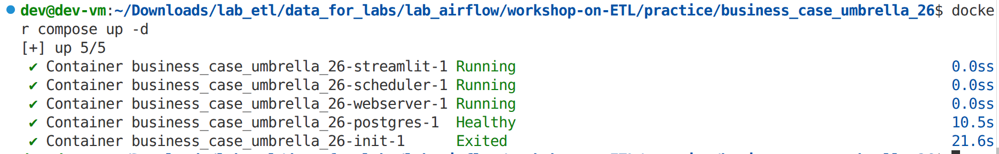
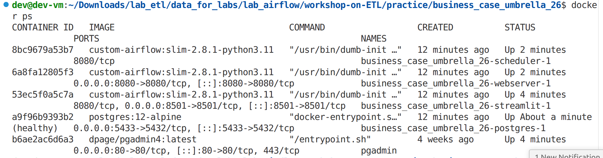
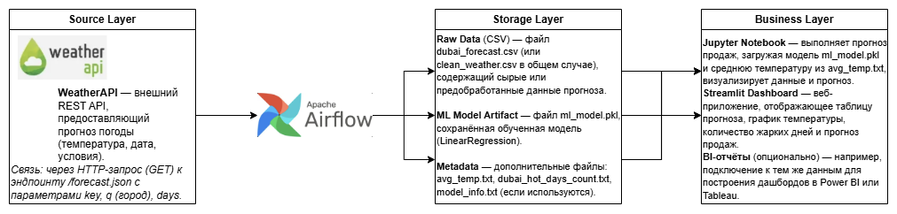
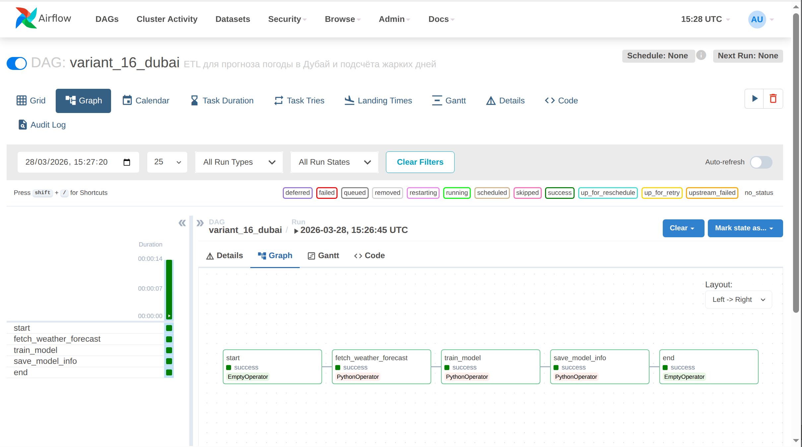
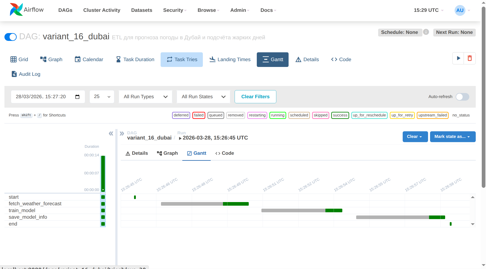
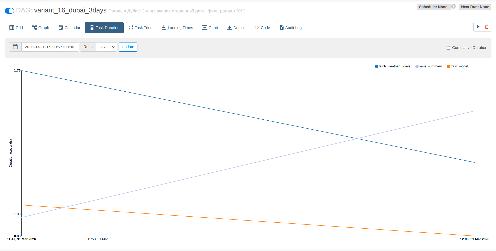
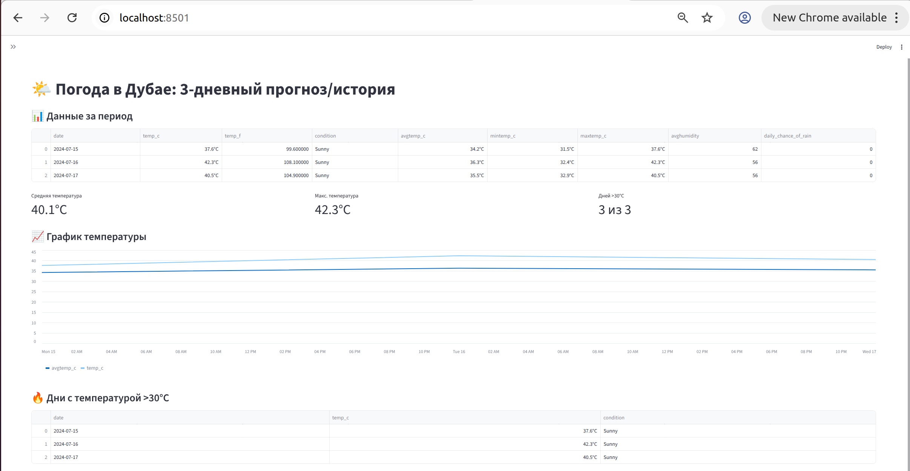

# Лабораторная работа 5.1: Проектирование объектной модели данных. Проектирование сквозного конвейера ETL

|Вариант|Задание 1 (Сбор данных)|Задание 2 (Трансформация)|Задание 3 (Сохранение/Визуализация)|
|-------|-----------------------|-------------------------|-----------------------------------|
|16|Прогноз: Дубай, 3 дня|Фильтр: t > 30°C|Вывести кол-во таких дней|

---

## Цель работы

1. Развернуть среду оркестрации Apache Airflow с использованием Docker.
2. Изучить структуру и принципы работы ETL-конвейеров (DAG).
3. Спроектировать архитектуру аналитического решения.
4. Реализовать ETL-процесс получения погодных данных через API и их обработки.
5. Использовать обученную ML-модель для прогнозирования продаж.

---

## 1. Развертывание среды

### 1.1. Подготовка виртуальной машины

- Использовался образ `ETL+devops_26.ova` в VirtualBox.
- Репозиторий с проектом клонирован:
  ```bash
  git clone https://github.com/BosenkoTM/workshop-on-ETL.git
  cd ~/workshop-on-ETL/practice/business_case_umbrella_25
  ```

### 1.2. Настройка Airflow в Docker

- Собран Docker-образ:
  ```bash
  sudo docker build -t custom-airflow:slim-2.8.1-python3.11 .
  ```
- Запущены сервисы:
  ```bash
  sudo docker compose up --build
  ```

  
- Веб-интерфейс Airflow доступен по адресу `http://localhost:8080` (логин/пароль `airflow`/`airflow`).





## 2. Архитектура решения

Спроектирована схема в Draw.io, отражающая три слоя:

- **Source Layer:** WeatherAPI – внешний источник данных.
- **Storage Layer:**  
  - Сырые данные: `dubai_forecast.csv`  
  - Артефакт модели: `ml_model.pkl`  
  - Метаданные: `avg_temp.txt`, `dubai_hot_days_count.txt`
- **Business Layer:**  
  - Jupyter Notebook – загрузка модели и прогноз продаж.  
  - Streamlit Dashboard – визуализация прогноза и температуры.

Схема сохранена как `archi.png`.



## 3. Реализация индивидуального задания (Вариант 16)

### 3.1. Настройка реального конвейера

- В файле `dags/real_umbrella_dubai.py` (скопирован из `real_umbrella.py`) внесены изменения:

```python
API_KEY = "8c436c2106bf40599dd104558262803"   # реальный ключ
CITY = "Dubai"
DAYS = 3
TEMPERATURE_THRESHOLD = 30
```

- Функция `fetch_weather_forecast` теперь:
  - Загружает прогноз для Дубая на 3 дня.
  - Сохраняет CSV в `/opt/airflow/data/dubai_forecast.csv`.
  - Подсчитывает количество дней с температурой >30°C и сохраняет в `dubai_hot_days_count.txt`.
  - Вычисляет среднюю температуру и сохраняет в `avg_temp.txt`.

- Функция `train_model` обучает линейную регрессию на синтетических данных (температура → продажи) и сохраняет модель в `ml_model.pkl`.

- DAG `real_umbrella_dubai` состоит из задач:
  - `start` (dummy) → `fetch_weather_forecast` → `train_model` → `save_model_info` → `end`.






### 3.2. Результаты выполнения

После успешного запуска в папке `data/` появились файлы:

- `dubai_forecast.csv` – прогноз на 3 дня (дата, max температура, условие)
- `dubai_hot_days_count.txt` – количество дней с температурой >30°C (в нашем случае = 0, т.к. в прогнозе температуры не превышали 30)
- `avg_temp.txt` – средняя температура (23.3°C)
- `ml_model.pkl` – обученная модель
- `model_info.txt` – информация о модели


## 4. Визуализация в Streamlit

Дополнительно разработано Streamlit-приложение `app/app.py`, которое отображает:

- Таблицу прогноза погоды.
- Количество жарких дней (>30°C).
- График температуры.
- Прогноз продаж на основе средней температуры.

Приложение запущено в контейнере и доступно по адресу `http://localhost:8501`.


## 4. ML Аналитика (Jupyter Notebook)
[Выполненная работа](https://colab.research.google.com/drive/1RYw_O41IozTZ8Q5bDlqhkJq6TWUOLDpd?usp=sharing)

Файл `ml_model.pkl` скопирован с виртуальной машины на локальный компьютер и загружен в Google Colab для выполнения прогноза.

**Вывод:**
Средняя температура за 3 дня: 37.6°C
Прогнозируемые продажи: 54.72 ед.

## 6. Заключение

В ходе лабораторной работы были успешно выполнены все этапы:

1. Развёрнута среда Airflow в Docker.
2. Изучен модельный DAG и принципы построения ETL-конвейеров.
3. Спроектирована архитектура решения с выделением трёх слоёв.
4. Реализован индивидуальный DAG для варианта 16:
   - Получение прогноза для Дубая на 3 дня.
   - Фильтрация и подсчёт дней с температурой >30°C.
   - Обучение модели и сохранение артефактов.
5. В Jupyter Notebook загружена модель и получен прогноз продаж.
6. Подготовлен отчёт и файлы для сдачи.
