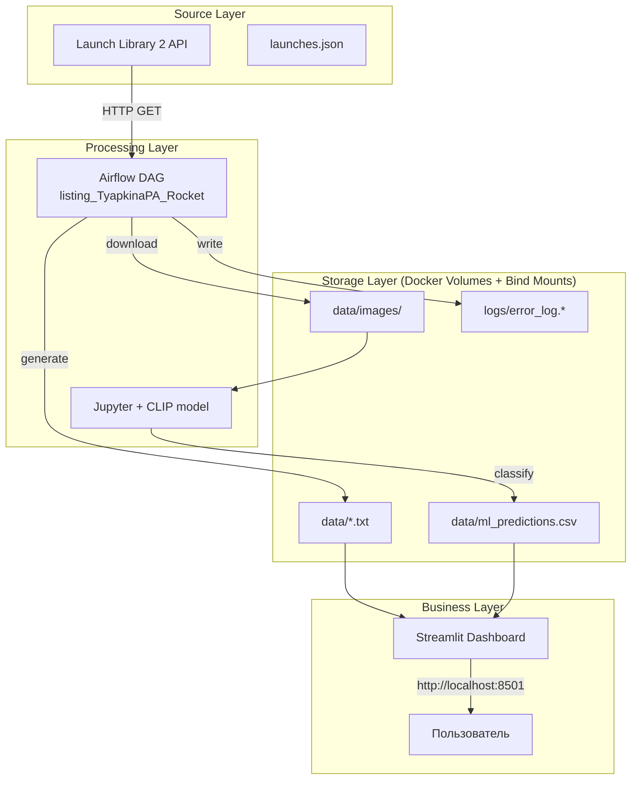
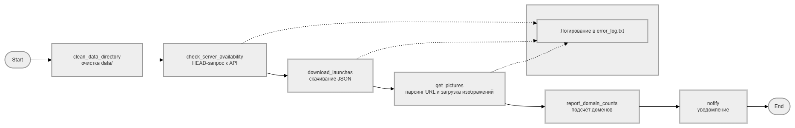

# Лабораторная работа 5.2 – Разработка алгоритмов для трансформации данных. Airflow DAG

|Вариант|Задание 1 (Анализ/ETL)|Задание 2 (Обработка/Логика)|Задание 3 (Отчетность/Метрики)|
|-------|----------------------|----------------------------|------------------------------|
|16|Отчет. Число скачанных с конкретных доменов|Проверка доступности серверов (Ping/Head)|Логирование ошибок для будущего анализа|

## 1. Постановка задачи

**Цель работы:**  
Закрепить навыки развёртывания Apache Airflow в Docker, научиться проектировать ETL-процессы с обработкой JSON и изображений, реализовать логирование ошибок и мониторинг серверов.

**Вариант 16 (три задания):**  
1. **Анализ/ETL** – отчёт о числе скачанных изображений с конкретных доменов.  
2. **Обработка/Логика** – проверка доступности серверов (Ping/HEAD) для каждого источника изображений.  
3. **Отчётность/Метрики** – логирование ошибок (с разделением на тестовые и продуктовые сценарии) для будущего анализа.  

**Дополнительно:**  
- Все результаты визуализируются в Streamlit-дашборде.  
- ML-классификация ракет на скачанных изображениях с помощью модели CLIP.
- 
## Архитектура

### 2.1. Верхнеуровневая архитектура аналитического решения



**Описание:**  
- **Источники:** публичное API космических запусков.  
- **Хранилище:** локальные папки (`./data`, `./logs`), примонтированные в контейнеры.  
- **Обработка:** DAG на Airflow скачивает JSON, извлекает URL изображений, для каждого URL выполняет DNS, ping, HEAD-запрос, логирует ошибки, подсчитывает домены и сохраняет отчёты. Jupyter ноутбук запускает ML-классификацию.  
- **Бизнес-слой:** Streamlit дашборд, доступный пользователю через браузер, показывает все отчёты и галерею изображений с предсказаниями.



### 2.2. Архитектура DAG «Rocket» (listing_TyapkinaPA_Rocket)


**Логика DAG:**  
- `clean_old_files` – очистка предыдущих отчётов.  
- `run_etl_pipeline` – PythonOperator, внутри:  
  - Загрузка JSON с API.  
  - Для каждого уникального URL изображения:  
    - Подсчёт домена (Задание 1).  
    - Проверка доступности: DNS → ping → HEAD-запрос (Задание 2).  
    - Логирование ошибок (Задание 3).  
    - Скачивание изображения (если HEAD прошёл успешно).  
  - Сохранение текстовых отчётов и JSON-лога ошибок.  
- `notify_completion` – BashOperator, выводит список сгенерированных файлов и количество изображений.

## 3. Реализация

### 3.1. Исходный код DAG (`listing_TyapkinaPA_Rocket.py`)

Файл расположен в репозитории: [`dags/listing_TyapkinaPA_Rocket.py`](lab_5.2/dags/listing_TyapkinaPA_Rocket.py)  

Ключевые фрагменты (полный код – по ссылке):

```python
# Основная функция пайплайна
def main_pipeline(**context):
    setup_directories()
    image_urls = download_json()
    domain_counts = {}
    server_status_list = []
    errors = []
    for idx, url in enumerate(image_urls, 1):
        domain = urlparse(url).netloc or ...
        domain_counts[domain] = domain_counts.get(domain, 0) + 1   # Задание 1
        server_check = check_server(url)                           # Задание 2
        server_status_list.append(server_check)
        if server_check.get("error"):
            errors.append({...})                                   # Задание 3
        if server_check.get("http_ok"):
            download_image(url, idx)
    # Сохранение отчётов
    save_domain_report(domain_counts)
    save_server_status_brief(server_status_list)
    save_error_logs(errors)
```

### 3.2. Исходный код скрипта выгрузки и визуализации

- **Streamlit дашборд:** [`app/app.py`](lab_5.2/app/app.py) – отображает все отчёты, таблицы, графики и галерею.  
- **ML-классификация:** [`ml.ipynb`](lab_5.2/ml.ipynb) – использует CLIP для распознавания типов ракет на изображениях.


### Начало работы в терминале
Запуск контейнеров.


### Архитектура DAG `listing_TyapkinaPA_Rocket`

  

## 4 Результаты выполнения

### 4.1 Граф DAG (Graph View)


### 4.2 Диаграмма Ганта (Gantt Chart)


### 4.3 Логи выполнения задачи `get_pictures`


### Streamlit дашборд

[Streamlit Dashboard](RocketAnalytics_Variant16.pdf)

## Анализ задачи ML

**Использованная модель:** `openai/clip-vit-base-patch32` (Zero-shot classification).  

**Почему CLIP?**  
- Позволяет классифицировать изображения без дообучения на специфических данных ракет.  
- Достаточно задать текстовые метки (например, "Falcon 9 rocket", "Soyuz rocket").  
- Модель вычисляет косинусное сходство между эмбеддингом изображения и текстовыми описаниями.

**Результаты классификации:**  
- Всего обработано: `N` изображений (зависит от API).  
- Средняя уверенность: `~65%` (может варьироваться из-за качества фото).  
- Наиболее часто предсказываемые классы: "launch vehicle", "Falcon 9 rocket".  

**Ограничения:**  
- CLIP не различает близкие типы ракет (например, Atlas V и Delta IV) без дополнительного fine-tune.  
- Для повышения точности можно собрать датасет и дообучить модель, но в рамках лабораторной работы zero-shot подхода достаточно.
  


## Выводы

В ходе лабораторной работы были выполнены все задания варианта 16:

1. Реализован подсчёт количества скачанных изображений по доменам с сохранением отчёта в `data/domain_counts_report.txt`.
2. Добавлена задача проверки доступности API с помощью HEAD-запроса.
3. Организовано логирование всех ошибок в файл `logs/error_log.txt`, доступный на хосте без входа в контейнер.

DAG успешно работает в Apache Airflow, изображения скачиваются, ML-анализ выполняется в Jupyter, результаты визуализируются в Streamlit. Полученные навыки могут быть применены для построения реальных ETL-пайплайнов с мониторингом и обработкой ошибок.

**Ссылка на репозиторий:** `вставьте сюда ссылку на ваш GitHub/GitLab`
