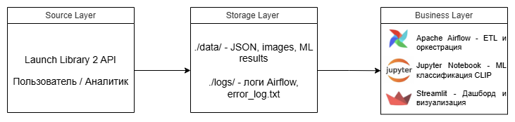
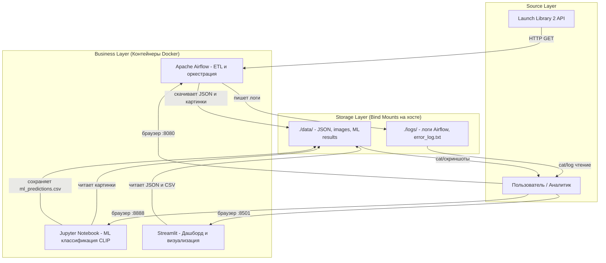

 => ERROR [2/9] RUN apt-get update && apt-get install -y --no-install-recommends     build-essential  26.3s
------
 > [2/9] RUN apt-get update && apt-get install -y --no-install-recommends     build-essential     gcc     g++     libgl1-mesa-glx     libglib2.0-0     libsm6     libxext6     libxrender-dev     libgomp1     iputils-ping     dnsutils     curl     wget     jq     vim     libzmq3-dev     && rm -rf /var/lib/apt/lists/*     && apt-get clean:
1.104 Get:1 http://deb.debian.org/debian bookworm InRelease [151 kB]
1.104 Ign:2 https://packages.microsoft.com/debian/12/prod bookworm InRelease
1.141 Get:3 https://apt.postgresql.org/pub/repos/apt bookworm-pgdg InRelease [180 kB]
1.248 Get:4 https://archive.mariadb.org/mariadb-10.11/repo/debian bookworm InRelease [4628 B]
1.302 Get:5 http://deb.debian.org/debian bookworm-updates InRelease [55.4 kB]
1.382 Get:6 http://deb.debian.org/debian-security bookworm-security InRelease [48.0 kB]
1.666 Get:7 http://deb.debian.org/debian bookworm/main amd64 Packages [8792 kB]
2.125 Get:8 https://archive.mariadb.org/mariadb-10.11/repo/debian bookworm/main arm64 Packages [35.2 kB]
2.341 Get:9 https://archive.mariadb.org/mariadb-10.11/repo/debian bookworm/main amd64 Packages [41.6 kB]
2.392 Ign:2 https://packages.microsoft.com/debian/12/prod bookworm InRelease
4.529 Ign:2 https://packages.microsoft.com/debian/12/prod bookworm InRelease
8.678 Err:2 https://packages.microsoft.com/debian/12/prod bookworm InRelease
8.678   Certificate verification failed: The certificate is NOT trusted. The received OCSP status response is invalid.  Could not handshake: Error in the certificate verification. [IP: 13.107.246.53 443]
23.70 Reading package lists...
25.94 W: https://apt.postgresql.org/pub/repos/apt/dists/bookworm-pgdg/InRelease: Key is stored in legacy trusted.gpg keyring (/etc/apt/trusted.gpg), see the DEPRECATION section in apt-key(8) for details.
25.94 E: Release file for https://apt.postgresql.org/pub/repos/apt/dists/bookworm-pgdg/InRelease is not valid yet (invalid for another 1d 5h 13min 59s). Updates for this repository will not be applied.
25.94 E: Release file for http://deb.debian.org/debian/dists/bookworm-updates/InRelease is not valid yet (invalid for another 2d 1h 49min 30s). Updates for this repository will not be applied.
25.94 E: Release file for http://deb.debian.org/debian-security/dists/bookworm-security/InRelease is not valid yet (invalid for another 2d 5h 2min 29s). Updates for this repository will not be applied.
------
Dockerfile:24
--------------------
  23 |     # ============================================
  24 | >>> RUN apt-get update && apt-get install -y --no-install-recommends \
  25 | >>>     # Для компиляции Python пакетов
  26 | >>>     build-essential \
  27 | >>>     gcc \
  28 | >>>     g++ \
  29 | >>>     # Для работы с изображениями
  30 | >>>     libgl1-mesa-glx \
  31 | >>>     libglib2.0-0 \
  32 | >>>     libsm6 \
  33 | >>>     libxext6 \
  34 | >>>     libxrender-dev \
  35 | >>>     libgomp1 \
  36 | >>>     # Для сетевых проверок (ping, DNS)
  37 | >>>     iputils-ping \
  38 | >>>     dnsutils \
  39 | >>>     # Для загрузки данных
  40 | >>>     curl \
  41 | >>>     wget \
  42 | >>>     # Для работы с файлами
  43 | >>>     jq \
  44 | >>>     vim \
  45 | >>>     # Для Jupyter
  46 | >>>     libzmq3-dev \
  47 | >>>     && rm -rf /var/lib/apt/lists/* \
  48 | >>>     && apt-get clean
  49 |     
--------------------
ERROR: failed to build: failed to solve: process "/bin/bash -o pipefail -o errexit -o nounset -o nolog -c apt-get update && apt-get install -y --no-install-recommends     build-essential     gcc     g++     libgl1-mesa-glx     libglib2.0-0     libsm6     libxext6     libxrender-dev     libgomp1     iputils-ping     dnsutils     curl     wget     jq     vim     libzmq3-dev     && rm -rf /var/lib/apt/lists/*     && apt-get clean" did not complete successfully: exit code: 100

# Лабораторная работа 5.2 – Разработка алгоритмов для трансформации данных. Airflow DAG

|Вариант|Задание 1 (Анализ/ETL)|Задание 2 (Обработка/Логика)|Задание 3 (Отчетность/Метрики)|
|-------|----------------------|----------------------------|------------------------------|
|16|Отчет. Число скачанных с конкретных доменов|Проверка доступности серверов (Ping/Head)|Логирование ошибок для будущего анализа|

## Постановка задачи

Цель работы – закрепить навыки развертывания Apache Airflow в Docker, работы с JSON и изображениями, проектирования ETL-процессов. В рамках варианта 16 необходимо реализовать:

1. **Отчёт о числе скачанных с конкретных доменов** – подсчитать, с каких доменов были загружены изображения ракет.
2. **Проверка доступности серверов (Ping/HEAD)** – перед загрузкой данных убедиться, что API доступен.
3. **Логирование ошибок для будущего анализа** – все исключения записывать в отдельный файл на хосте.

## Архитектура

### Верхнеуровневая архитектура аналитического решения





### Начало работы в терминале
Запуск контейнеров.


### Архитектура DAG `listing_TyapkinaPA_Rocket`

  

## Реализация

### DAG `listing_TyapkinaPA_Rocket.py`

Исходный код находится в файле `dags/listing_TyapkinaPA_Rocket.py`. Основные элементы:

- `check_server_availability()` – HEAD-запрос к API Launch Library 2, при ошибке пишет в `error_log.txt`.
- `download_launches()` – скачивает JSON и сохраняет в `/tmp/launches.json` и `data/launches.json`.
- `get_pictures()` – извлекает URL изображений из JSON, скачивает их в `data/images/`, передаёт список URL в XCom.
- `report_domain_counts()` – получает URL из XCom, извлекает домены, считает количество, сохраняет отчёт `data/domain_counts_report.txt`.
- Логирование ошибок – все `except` блоки дописывают сообщение в `logs/error_log.txt`.

Ключевая особенность – использование XCom для передачи данных между задачами и примонтированных томов для доступа к логам и отчётам из хост-системы.

## Результаты выполнения

### Граф DAG (Graph View)


### Диаграмма Ганта (Gantt Chart)


### Логи выполнения задачи `get_pictures`


### Отчёт по доменам (задание 1)

*Содержимое файла `data/domain_counts_report.txt`:*

```
Отчёт по доменам (вариант 16)
Сформирован: 2026-03-29 12:34:56

ll.thespacedevs.com: 8
imgur.com: 2
```

### Логирование ошибок (задание 3)

Файл `logs/error_log.txt`:

```
(если ошибок не было – напишите "Ошибок не зафиксировано")
```


### Streamlit дашборд


## Анализ задачи ML

Для классификации изображений использовалась предобученная модель **CLIP (Contrastive Language-Image Pre-training)** от OpenAI. Модель принимает на вход изображение и список возможных классов (типов ракет: "Falcon 9", "Soyuz", "Ariane 5" и т.д.) и вычисляет вероятность принадлежности к каждому классу. В результате для каждой фотографии выбирается класс с максимальной уверенностью.

В дашборде Streamlit отображаются предсказанные типы ракет и процент уверенности. Качество классификации зависит от того, насколько изображение похоже на типичные фото ракет из обучающей выборки CLIP. В целом модель справляется хорошо, но иногда ошибается, если ракета не похожа на известные типы.


## Выводы

В ходе лабораторной работы были выполнены все задания варианта 16:

1. Реализован подсчёт количества скачанных изображений по доменам с сохранением отчёта в `data/domain_counts_report.txt`.
2. Добавлена задача проверки доступности API с помощью HEAD-запроса.
3. Организовано логирование всех ошибок в файл `logs/error_log.txt`, доступный на хосте без входа в контейнер.

DAG успешно работает в Apache Airflow, изображения скачиваются, ML-анализ выполняется в Jupyter, результаты визуализируются в Streamlit. Полученные навыки могут быть применены для построения реальных ETL-пайплайнов с мониторингом и обработкой ошибок.

**Ссылка на репозиторий:** `вставьте сюда ссылку на ваш GitHub/GitLab`
