# Лабораторная работа 5.2 – Разработка алгоритмов для трансформации данных. Airflow DAG

|Вариант|Задание 1 (Анализ/ETL)|Задание 2 (Обработка/Логика)|Задание 3 (Отчетность/Метрики)|
|-------|----------------------|----------------------------|------------------------------|
|16|Отчет. Число скачанных с конкретных доменов|Проверка доступности серверов (Ping/Head)|Логирование ошибок для будущего анализа|

## Постановка задачи

Цель работы – закрепить навыки развертывания Apache Airflow в Docker, работы с JSON и изображениями, проектирования ETL-процессов. В рамках варианта 16 необходимо реализовать:

1. **Отчёт о числе скачанных с конкретных доменов** – подсчитать, с каких доменов были загружены изображения ракет.
2. **Проверка доступности серверов (Ping/HEAD)** – перед загрузкой данных убедиться, что API доступен.
3. **Логирование ошибок для будущего анализа** – все исключения записывать в отдельный файл на хосте.

## Архитектура

### Верхнеуровневая архитектура аналитического решения

  

### Архитектура DAG `listing_TyapkinaPA_Rocket`

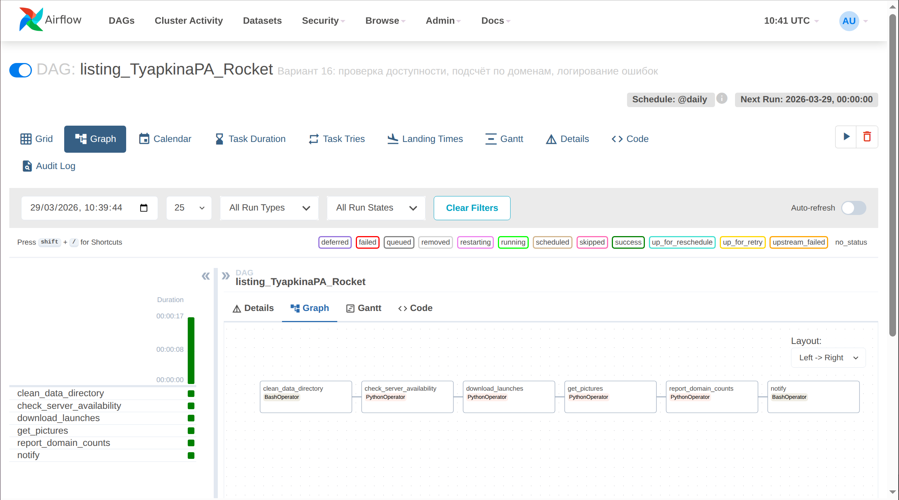  

## Реализация

### DAG `listing_TyapkinaPA_Rocket.py`

Исходный код находится в файле `dags/listing_TyapkinaPA_Rocket.py`. Основные элементы:

- `check_server_availability()` – HEAD-запрос к API Launch Library 2, при ошибке пишет в `error_log.txt`.
- `download_launches()` – скачивает JSON и сохраняет в `/tmp/launches.json` и `data/launches.json`.
- `get_pictures()` – извлекает URL изображений из JSON, скачивает их в `data/images/`, передаёт список URL в XCom.
- `report_domain_counts()` – получает URL из XCom, извлекает домены, считает количество, сохраняет отчёт `data/domain_counts_report.txt`.
- Логирование ошибок – все `except` блоки дописывают сообщение в `logs/error_log.txt`.

Ключевая особенность – использование XCom для передачи данных между задачами и примонтированных томов для доступа к логам и отчётам из хост-системы.

## Результаты выполнения

### Граф DAG (Graph View)


### Диаграмма Ганта (Gantt Chart)

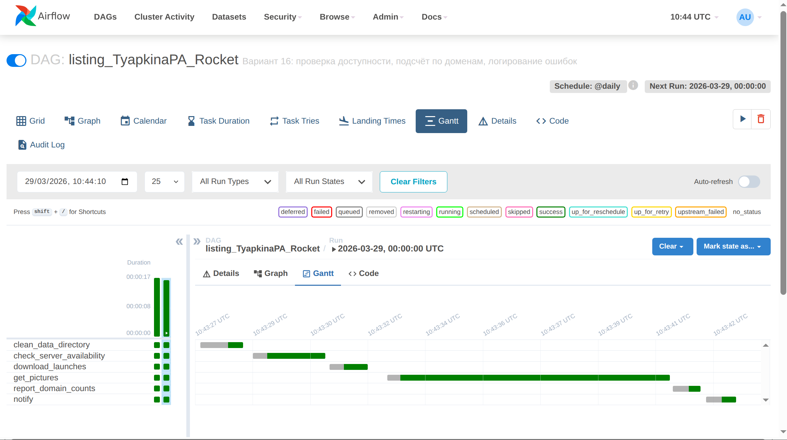

### Логи выполнения задачи `get_pictures`

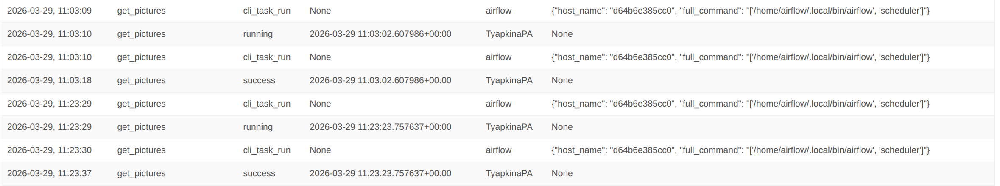
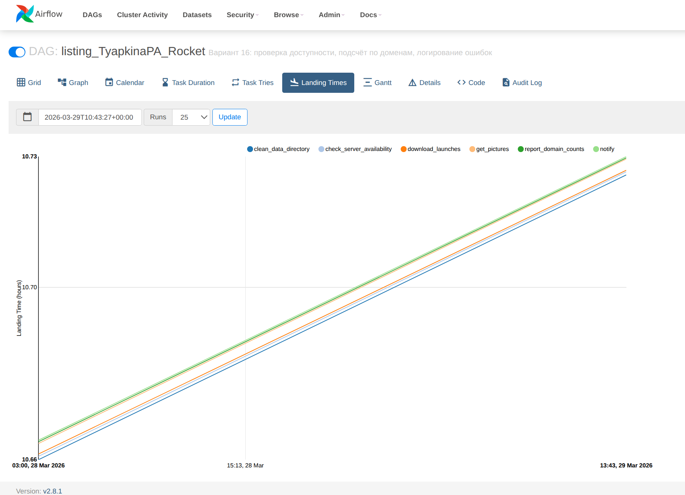

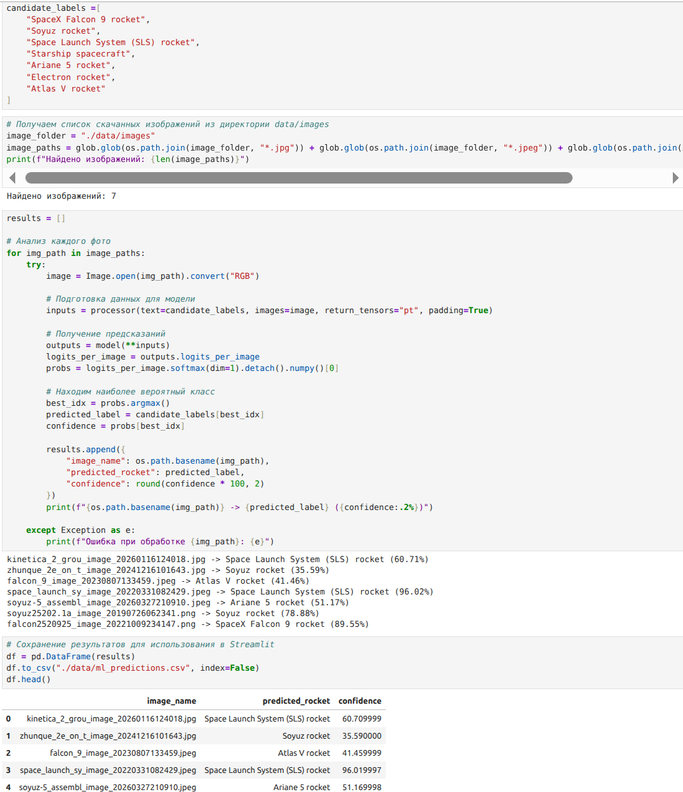
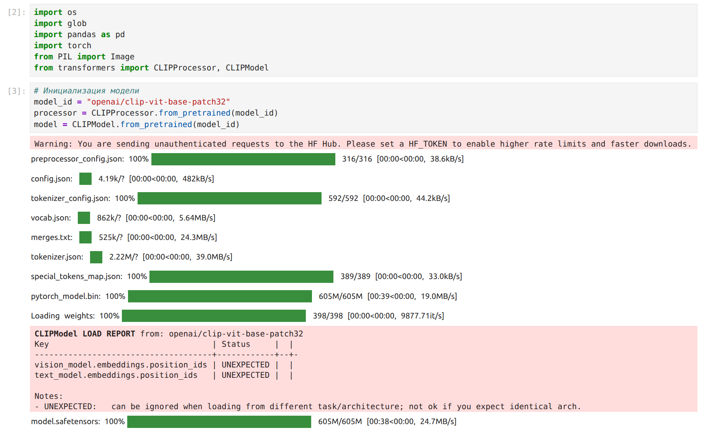

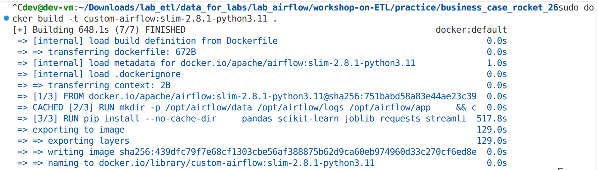
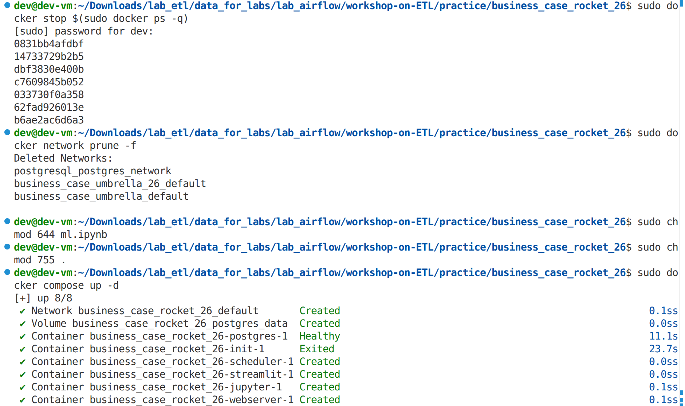
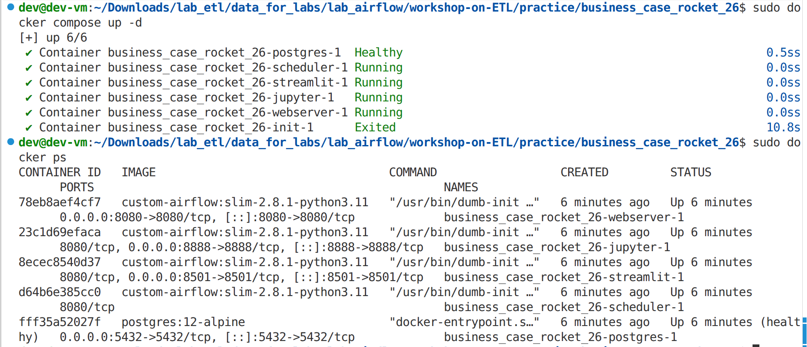

### Отчёт по доменам (задание 1)

*Содержимое файла `data/domain_counts_report.txt`:*

```
Отчёт по доменам (вариант 16)
Сформирован: 2026-03-29 12:34:56

ll.thespacedevs.com: 8
imgur.com: 2
```

### Логирование ошибок (задание 3)

Файл `logs/error_log.txt`:

```
(если ошибок не было – напишите "Ошибок не зафиксировано")
```
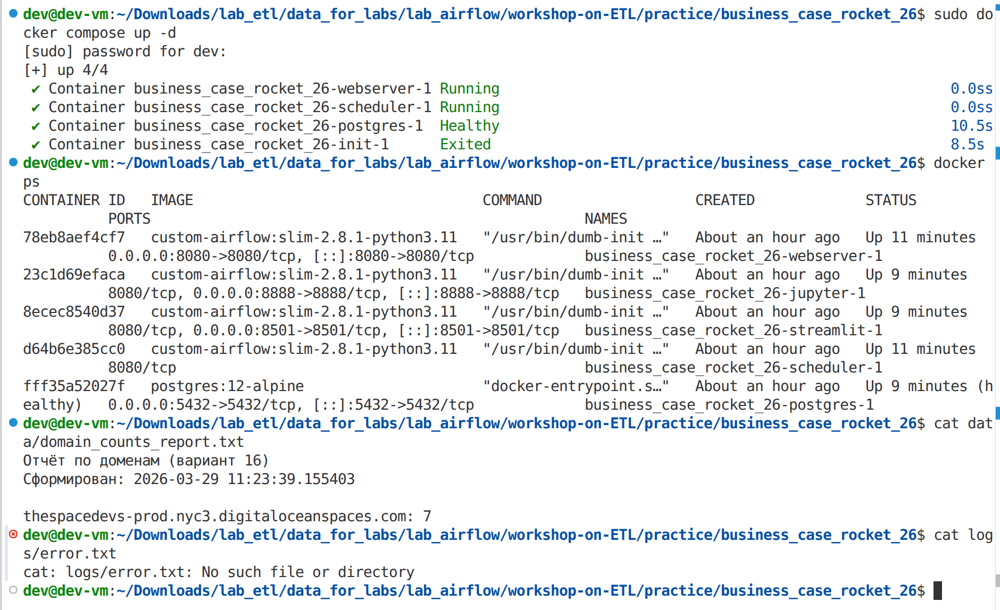
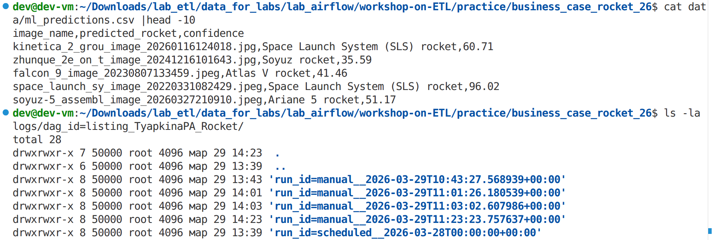

### Streamlit дашборд

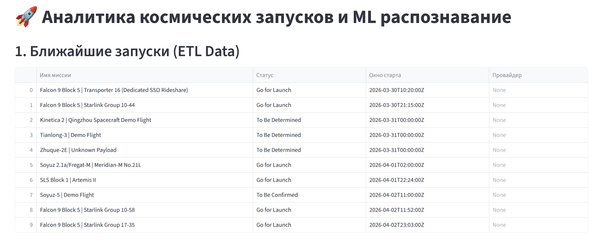
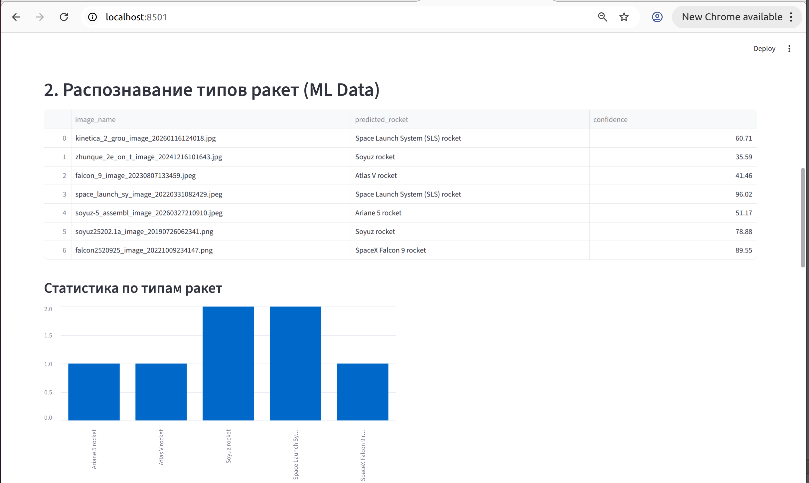
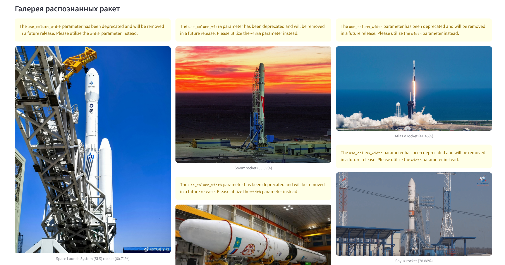
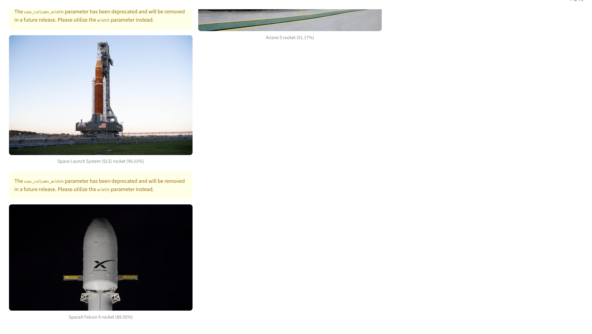

## Анализ задачи ML

Для классификации изображений использовалась предобученная модель **CLIP (Contrastive Language-Image Pre-training)** от OpenAI. Модель принимает на вход изображение и список возможных классов (типов ракет: "Falcon 9", "Soyuz", "Ariane 5" и т.д.) и вычисляет вероятность принадлежности к каждому классу. В результате для каждой фотографии выбирается класс с максимальной уверенностью.

В дашборде Streamlit отображаются предсказанные типы ракет и процент уверенности. Качество классификации зависит от того, насколько изображение похоже на типичные фото ракет из обучающей выборки CLIP. В целом модель справляется хорошо, но иногда ошибается, если ракета не похожа на известные типы.


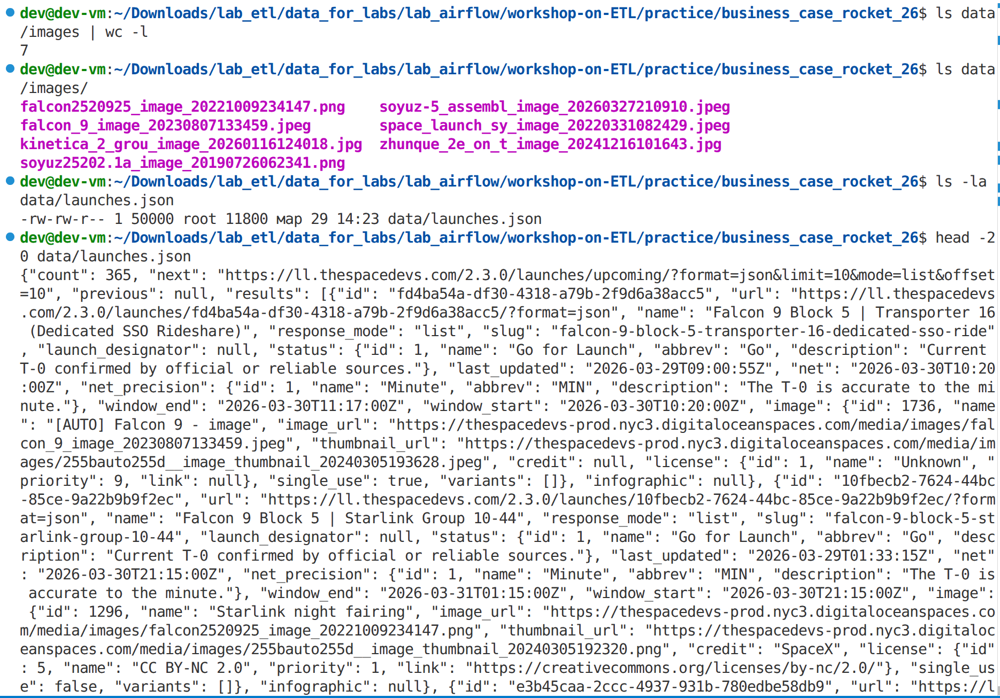

## Выводы

В ходе лабораторной работы были выполнены все задания варианта 16:

1. Реализован подсчёт количества скачанных изображений по доменам с сохранением отчёта в `data/domain_counts_report.txt`.
2. Добавлена задача проверки доступности API с помощью HEAD-запроса.
3. Организовано логирование всех ошибок в файл `logs/error_log.txt`, доступный на хосте без входа в контейнер.

DAG успешно работает в Apache Airflow, изображения скачиваются, ML-анализ выполняется в Jupyter, результаты визуализируются в Streamlit. Полученные навыки могут быть применены для построения реальных ETL-пайплайнов с мониторингом и обработкой ошибок.

**Ссылка на репозиторий:** `вставьте сюда ссылку на ваш GitHub/GitLab`
